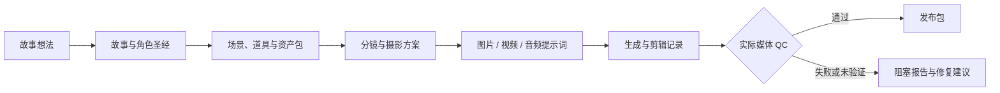

# AI 短剧流水线 · Codex Skill

中文 | [English](README_EN.md)

把一个故事想法拆成可执行、可复盘的 AI 短剧生产包：

**创意与受众 → 剧本与角色 → 场景与道具 → 分镜与提示词 → 生成记录 → 成片质检 → 发布包**

适合竖屏短剧、网文改编、连载爽剧、2D 动画打斗和 3D 国漫战斗。它不绑定某一家图片、视频或音频平台；你可以使用现有的本地工具、网页工具、API 或人工上传流程。

> 这不是一键出片按钮。它解决的是 AI 短剧制作中最容易失控的部分：角色和场景不一致、分镜不可执行、提示词缺少镜头逻辑、素材状态混乱，以及没有真正检查成片就宣布完成。

## 快速安装

在 Codex 中输入：

```text
$skill-installer install https://github.com/ouyangevan/codex-short-drama-pipeline-skill/tree/main/skills/short-drama-pipeline
```

安装后新建一个 Codex 任务。如果当前版本不支持 `$skill-installer`，可以手动安装：

```powershell
git clone https://github.com/ouyangevan/codex-short-drama-pipeline-skill.git
Copy-Item -Recurse .\codex-short-drama-pipeline-skill\skills\short-drama-pipeline "$env:USERPROFILE\.codex\skills\short-drama-pipeline"
```

macOS / Linux：

```bash
git clone https://github.com/ouyangevan/codex-short-drama-pipeline-skill.git
cp -R ./codex-short-drama-pipeline-skill/skills/short-drama-pipeline ~/.codex/skills/short-drama-pipeline
```

## 第一次使用

直接把下面这段话交给 Codex，再换成你自己的故事：

```text
使用 short-drama-pipeline，把这个想法整理成 3 集竖屏复仇短剧生产包。

故事：被家族赶走的女主三年后带着隐藏身份归来。
我现有的工具：一个图片模型、一个支持首尾帧的视频工具，以及剪映。

先完成故事、角色、场景、分镜和提示词；缺少生成工具时不要假装已经出片，
请输出 dry-run 制作包并标明卡在哪一个交付门。
```

## 你会得到什么

一次完整运行会按当前项目需要创建类似这样的生产包：

```text
short-drama-project/
├── 00_idea.md                         # 核心创意、受众与约束
├── 01_story_bible.md                  # 故事世界与连续性
├── 01C_series_engine.md               # 连载结构、钩子与升级路线
├── 02_character_bible.md              # 角色设定与一致性要求
├── 03_scene_bible.md                  # 场景、空间和光色规则
├── 03C_prop_and_evidence_ledger.md     # 道具与证据连续性
├── 04_storyboard.md                    # 可执行分镜
├── 04G_cinematography_bible.md         # 镜头与摄影语言
├── 05_prompt_pack.md                   # 图片、视频和音频提示词
├── 06_generation_log.md                # 生成记录与素材状态
├── 07_qc_report.md                     # 实际检查结果与阻塞项
└── 08_release_pack.md                  # 字幕、封面和发布信息
```

Skill 会根据你真正拥有的工具选择路线。没有视频工具时，可以只交付剧本、资产规格、分镜和提示词；没有完成媒体检查时，不会把草稿描述成可发布成片。

## 适合哪些场景

- **竖屏爽剧**：建立每集钩子、反转、人物目标和连续性规则。
- **网文改短剧**：把长文本压缩成可拍、可生成的短剧结构。
- **系列短剧**：管理角色、场景、道具和多集升级路线。
- **3D 国漫 / 2D 动画打斗**：先生成结构化战斗编排，再编译成视频提示词。
- **多工具协作**：按照能力选择图片、视频、配音、音效和剪辑路线，而不是绑定品牌。
- **提示词测试**：使用 `prompt_test_mode=true` 快速比较提示词，不必先建立完整项目包。

## 工作方式



## 战斗与动作示例

仓库包含经过 JSON Schema 校验的单镜头与多镜头战斗编排示例：

- [8 镜头完整战斗序列](skills/short-drama-pipeline/examples/combat/full_fight_sequence_8_shots.json)
- [3D 国漫法相压制](skills/short-drama-pipeline/examples/combat/3d_guoman_avatar_suppression.json)
- [2D 水墨兵器对撞](skills/short-drama-pipeline/examples/combat/2d_ink_weapon_clash.json)
- [真人近身交换](skills/short-drama-pipeline/examples/combat/live_action_close_quarters_exchange.json)
- [快速单次重击](skills/short-drama-pipeline/examples/combat/fast_route_single_impact.json)

打斗镜头不会直接跳到普通视频提示词。Skill 会先整理动作节拍、冲击反馈、力量升级、特效逻辑、摄影覆盖、素材绑定和 QC 分数，再生成执行提示词。

## 三道交付门

每个正式生产阶段都需要报告：

```text
Gate Status:
- knowledge_gate: PASS/FAIL
- asset_gate: PASS/FAIL/N/A
- qc_gate: PASS/FAIL/QC_UNVERIFIED/N/A
- allowed_output: deliverable|blocked_report_only
```

- `knowledge_gate`：当前阶段是否真的读取并应用了必要规则。
- `asset_gate`：角色、场景和参考素材是否足以支持当前生成任务。
- `qc_gate`：生成的图片、视频、声音或成片是否经过实际检查。

任一必要门未通过时，只允许交付阻塞报告，不允许把未验证结果包装成完成品。

## 不绑定固定平台

这个 Skill 不要求 Seedance、即梦、可灵、Vidu、Runway、Pika、Luma、Midjourney、ComfyUI 或任何其他固定供应商。平台名称只在能力确实匹配时作为可选策略使用。

你可以用能力名称描述自己的工具：

- `image_asset_route`：角色、场景、道具与关键帧
- `video_draft_route`：低成本动态草稿
- `video_final_route`：最终视频生成
- `audio_voice_route`：对白与配音
- `editing_route`：字幕、音效、合成和导出

## 仓库结构

- `skills/short-drama-pipeline/SKILL.md`：触发规则、阶段路由和交付门契约。
- `skills/short-drama-pipeline/knowledge_compiled/`：稳定、精简的生产规则缓存。
- `skills/short-drama-pipeline/references/`：工作流、项目包、提示词、QC 和操作规范。
- `skills/short-drama-pipeline/core/combat/`：战斗导演与提示词编译模块。
- `skills/short-drama-pipeline/schemas/`：单镜头与多镜头战斗 JSON Schema。
- `skills/short-drama-pipeline/examples/`：已校验示例。
- `skills/short-drama-pipeline/providers/`：可选的平台能力策略。

## 当前状态与安全边界

这是从本地工作版本清理出的公开包。仓库不包含个人路径、账号凭据、API key、私有研究库或本地主机验证器；平台特定默认值已经改成能力路由。

现阶段建议先把它用于新项目或 dry-run，并根据自己的工具补充私有路线配置。正式商用前仍需人工确认素材授权、平台合规和最终内容质量。

如果它对你的工作有帮助，欢迎 Star；如果某个阶段难用、规则冲突或安装失败，请直接提交 [Issue](https://github.com/ouyangevan/codex-short-drama-pipeline-skill/issues)。真实使用反馈比单纯增加功能更有价值。

## License

MIT，见 [LICENSE](LICENSE)。
