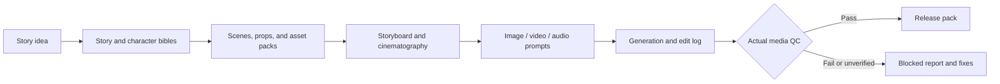

# Short Drama Pipeline · Codex Skill

[中文](README.md) | English

Turn a short-drama idea into an executable, auditable production package:

**Idea and audience → script and characters → scenes and props → storyboard and prompts → generation log → media QC → release pack**

It supports vertical drama, serialized stories, web-fiction adaptation, 2D action, and 3D donghua combat. The workflow is provider-agnostic: use your existing image, video, audio, editing, API, local, or manual-upload tools.

> This is not a one-click video generator. It is a production system for the parts of AI short-drama work that commonly break: continuity, asset readiness, executable storyboards, prompt structure, generation tracking, and honest media QC.

## Quick Install

Ask Codex to install the skill:

```text
$skill-installer install https://github.com/ouyangevan/codex-short-drama-pipeline-skill/tree/main/skills/short-drama-pipeline
```

Then start a new Codex task. If `$skill-installer` is unavailable in your version, install manually.

Windows PowerShell:

```powershell
git clone https://github.com/ouyangevan/codex-short-drama-pipeline-skill.git
Copy-Item -Recurse .\codex-short-drama-pipeline-skill\skills\short-drama-pipeline "$env:USERPROFILE\.codex\skills\short-drama-pipeline"
```

macOS / Linux:

```bash
git clone https://github.com/ouyangevan/codex-short-drama-pipeline-skill.git
cp -R ./codex-short-drama-pipeline-skill/skills/short-drama-pipeline ~/.codex/skills/short-drama-pipeline
```

## First Run

```text
Use short-drama-pipeline to turn this idea into a three-episode vertical revenge-drama production package.

Story: A woman expelled by her family returns three years later with a hidden identity.
Available tools: one image model, one first/end-frame video tool, and a desktop editor.

Finish the story, character, scene, storyboard, and prompt stages first. If a generation
tool is missing, deliver a dry-run package and identify the blocked gate instead of claiming
that final media exists.
```

## What You Get

A full run creates only the artifacts required by the current project, following a structure such as:

```text
short-drama-project/
├── 00_idea.md
├── 01_story_bible.md
├── 01C_series_engine.md
├── 02_character_bible.md
├── 03_scene_bible.md
├── 03C_prop_and_evidence_ledger.md
├── 04_storyboard.md
├── 04G_cinematography_bible.md
├── 05_prompt_pack.md
├── 06_generation_log.md
├── 07_qc_report.md
└── 08_release_pack.md
```

The skill selects a route based on tools you actually have. It can stop at a script, asset specification, storyboard, or prompt pack when generation is unavailable. Uninspected media is never presented as a finished release.

## Core Use Cases

- Vertical revenge, romance, suspense, and serialized short drama.
- Web-fiction adaptation into generation-ready episodes.
- Character, scene, prop, and continuity management across episodes.
- Structured 2D, 3D donghua, and live-action-style combat direction.
- Provider-agnostic coordination of image, video, voice, sound, and editing tools.
- Lightweight prompt comparison with `prompt_test_mode=true`.

## Workflow



## Combat Examples

The repository includes JSON-Schema-validated single-shot and multi-shot combat examples:

- [Eight-shot full fight sequence](skills/short-drama-pipeline/examples/combat/full_fight_sequence_8_shots.json)
- [3D donghua avatar suppression](skills/short-drama-pipeline/examples/combat/3d_guoman_avatar_suppression.json)
- [2D ink weapon clash](skills/short-drama-pipeline/examples/combat/2d_ink_weapon_clash.json)
- [Live-action close-quarters exchange](skills/short-drama-pipeline/examples/combat/live_action_close_quarters_exchange.json)
- [Fast-route single impact](skills/short-drama-pipeline/examples/combat/fast_route_single_impact.json)

Combat shots first produce a structured compiler artifact covering action beats, impact feedback, power escalation, VFX logic, camera coverage, asset bindings, provider strategy, and QC. The execution prompt comes after that structure.

## Delivery Gates

Every formal production stage reports:

```text
Gate Status:
- knowledge_gate: PASS/FAIL
- asset_gate: PASS/FAIL/N/A
- qc_gate: PASS/FAIL/QC_UNVERIFIED/N/A
- allowed_output: deliverable|blocked_report_only
```

- `knowledge_gate` verifies that the required production rules were read and applied.
- `asset_gate` verifies that character, scene, and reference assets are ready for the selected generation route.
- `qc_gate` records actual inspection of generated images, clips, audio, edits, or releases.

If a required gate fails, the skill returns a blocked report instead of presenting unverified work as usable.

## Provider-Agnostic by Design

The skill does not require Seedance, Kling, Vidu, Runway, Pika, Luma, Midjourney, ComfyUI, or any fixed provider. Provider notes are optional strategies used only when their capabilities match the selected route.

Describe tools by capability when possible:

- `image_asset_route`
- `video_draft_route`
- `video_final_route`
- `audio_voice_route`
- `editing_route`

## Repository Layout

- `skills/short-drama-pipeline/SKILL.md`: trigger rules, stage routing, and delivery-gate contract.
- `skills/short-drama-pipeline/knowledge_compiled/`: stable compiled production rules.
- `skills/short-drama-pipeline/references/`: workflow, project-package, prompting, QC, and operations specifications.
- `skills/short-drama-pipeline/core/combat/`: fight-direction and combat-prompt compiler modules.
- `skills/short-drama-pipeline/schemas/`: single-shot and sequence JSON schemas.
- `skills/short-drama-pipeline/examples/`: validated examples.
- `skills/short-drama-pipeline/providers/`: optional provider capability strategies.

## Status and Safety Boundary

This public package was sanitized from a local working skill. It does not include personal filesystem paths, account credentials, API keys, private research corpora, or host-local validators. Provider-specific defaults were converted into capability routes.

Forward-test it on new projects or dry runs before adopting it as a production standard. Human review is still required for source rights, platform compliance, story taste, and final media quality.

If the skill helps, consider starring the repository. For installation failures, unclear stages, or conflicting rules, open an [Issue](https://github.com/ouyangevan/codex-short-drama-pipeline-skill/issues).

## License

MIT. See [LICENSE](LICENSE).
